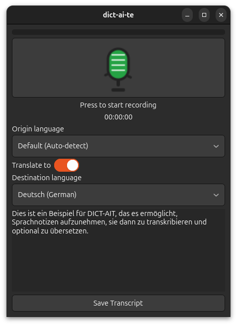
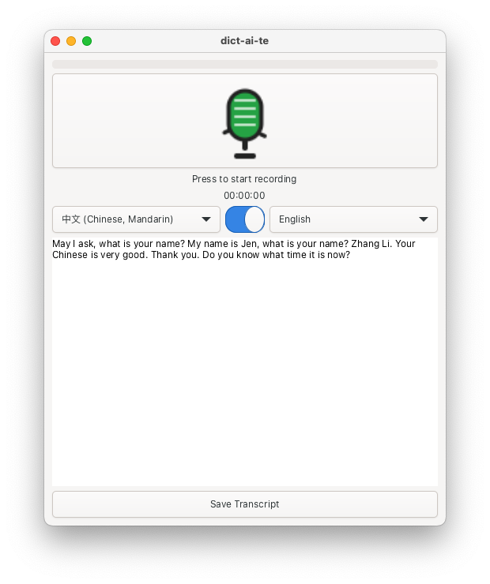
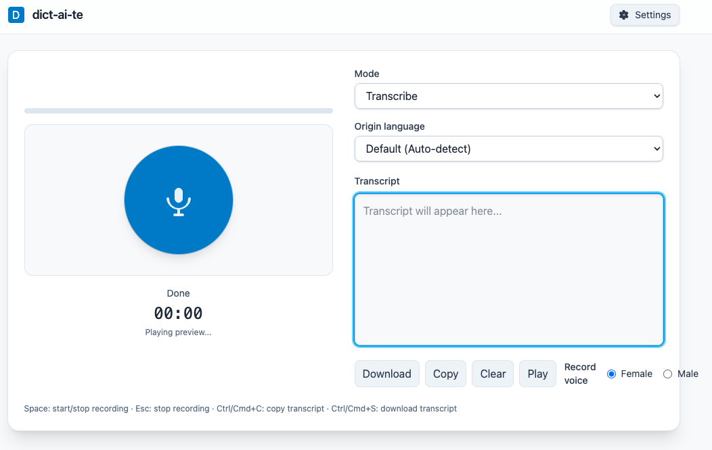
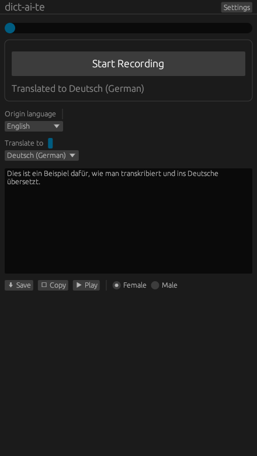

# dict-ai-te

[](LICENSE)
[](https://github.com/soyrochus/dict-ai-te)
[](./FOSS_PLURALISM_MANIFESTO.md)

**dict-ai-te** is a live dictation and live speech-translation application. Start listening, speak into your microphone, and see source text or translated text appear while the session is still running. It is available in three forms:

- A **native Rust desktop app** using egui/eframe — the reference implementation
- A **Python GTK 4 desktop app** (Linux / macOS)
- A **Python Flask web app** — same features, accessible from any browser

All three share the same settings file (`~/.dictaite/settings.json`) and connect to the same OpenAI Realtime API backend. The Python implementations are a feature-exact clone of the Rust app.

For a deep technical dive into how everything fits together, see the **[Architecture Guide](architecture-guide.md)**.

| Python GTK (Ubuntu) | Python GTK (macOS) |
| :----: | :---: |
|  |  |

| Python Web (Flask) | Rust (egui; shown on Ubuntu) |
| :----:      |:---:            |
|  | |

## Features

- **Live transcription** — audio streams directly to OpenAI Realtime (`gpt-4o-transcribe`) and transcribed words appear as you speak.
- **Live translation** — optionally route the session through the `gpt-realtime` translation endpoint; source and translated transcripts accumulate simultaneously.
- **TTS playback** — read back the transcript in a chosen voice via the OpenAI TTS API (`tts-1`).
- **Audio level meter** — visual level bar during both recording and playback.
- **Elapsed-time timer** — shows how long the current session has been running.
- **Origin and target language selection** — choose from 20+ languages; auto-detect is the default.
- **Save, copy, edit** — save the transcript as a `.txt` file, copy it to the clipboard, or edit it directly in the text area.
- **Shared settings** — default language, voice preferences, and translate-by-default are stored in `~/.dictaite/settings.json` and shared across all app variants.
- **Zero local models** — all speech recognition and translation run on OpenAI's infrastructure; only an API key is required.

## Quick Start

### Prerequisites

- An OpenAI API key with access to the Realtime API.
- Python 3.12+ **or** Rust toolchain (for the respective app variant).
- Linux or macOS (Windows supported for the Rust app).

### 1. Clone

```bash
git clone https://github.com/soyrochus/dict-ai-te.git
cd dict-ai-te
```

### 2. Set your API key

```bash
export OPENAI_API_KEY=your_key_here
# or create a .env file:
echo "OPENAI_API_KEY=your_key_here" > .env
```

### 3. Run

**Rust (recommended — the reference implementation):**

```bash
cargo run --release
```

**Python GTK desktop:**

```bash
uv sync
python -m dictaite          # or: bin/dictaite
```

**Python web UI:**

```bash
uv sync
bin/dictaite-web            # then open http://localhost:8080
```

---

## Installation — Python

### System dependencies

**Linux (Ubuntu/Debian):**

```bash
sudo apt update
sudo apt install -y \
  libgtk-4-dev libgirepository-2.0-dev libcairo2-dev pkg-config \
  python3-dev python3-gi python3-gi-cairo gir1.2-gtk-4.0 \
  libportaudio2
```

**macOS:**

```bash
brew install gtk4 pygobject3 portaudio
```

### Python dependencies

```bash
uv venv .venv
source .venv/bin/activate
uv sync
```

### Running

```bash
# GTK desktop app
python -m dictaite
# or
bin/dictaite

# Web UI
bin/dictaite-web
# or
uv run -m dictaite.ui_web.app
```

Visit `http://localhost:8080` for the web UI.

---

## Installation — Rust

### System dependencies (Ubuntu 24.04+)

```bash
sudo apt update
sudo apt install -y \
  build-essential pkg-config libssl-dev \
  libasound2-dev libjack-jackd2-dev \
  libx11-dev libxi-dev libxcb1-dev libxcb-render0-dev \
  libxcb-shape0-dev libxcb-xfixes0-dev \
  libxkbcommon-dev libwayland-dev libgl1-mesa-dev libudev-dev \
  libvulkan1 vulkan-tools mesa-vulkan-drivers libvulkan-dev \
  libgtk-3-dev \
  xclip wl-clipboard
```

**Why each dependency is needed:**

- `build-essential`, `pkg-config` — C compiler and metadata tooling
- `libssl-dev` — TLS (used by `reqwest` for HTTPS)
- `libasound2-dev`, `libjack-jackd2-dev` — audio I/O (`cpal` / `rodio`)
- X11/Wayland/GL stack — rendering (`eframe` / `wgpu`)
- `libudev-dev` — device enumeration (`wgpu`)
- Vulkan stack — GPU rendering backend for `wgpu`
- `libgtk-3-dev` — native file dialogs (`rfd`)
- `xclip`, `wl-clipboard` — clipboard integration (`arboard`)

### Build and run

```bash
cargo build --release
cargo run --release
# or
./target/release/dict_ai_te
```

---

## Web UI reference

The Flask interface mirrors the GTK and Rust layout using TailwindCSS and vanilla JavaScript. Audio is captured in the browser, converted to mono 24 kHz PCM16, base64-encoded, and sent to the server over a WebSocket. The server holds the API key and relays events back.

### WebSocket endpoints

| Endpoint | Description |
| --- | --- |
| `GET /ws/live/transcribe` | Live transcription session |
| `GET /ws/live/translate` | Live translation session |

**Session protocol:**

1. Connect to the endpoint.
2. Send `{ "type": "start", "source_language": "<code>", "target_language": "<name>" }`.
3. Send audio chunks: `{ "type": "audio", "audio": "<base64-pcm16>" }`.
4. Receive events: `{ "type": "source_delta" | "translation_delta" | "session_state" | "error", "text": "...", "state": "...", "error": "..." }`.
5. Send `{ "type": "stop" }` to end.

### REST endpoints

| Endpoint | Method | Description |
| --- | --- | --- |
| `/api/settings` | GET / POST | Read / write settings |
| `/api/tts-test` | POST | Generate voice preview (`{ gender, text, voice? }` → `audio/wav`) |
| `/api/health` | GET | Readiness probe |

### Browser shortcuts

| Key | Action |
| --- | --- |
| `Space` | Start / stop recording (when textarea is not focused) |
| `Ctrl/Cmd+C` | Copy transcript |
| `Ctrl/Cmd+S` | Save transcript as `.txt` |

---

## Configuration

Settings are stored in `~/.dictaite/settings.json` and shared between all app variants. You can also override the config directory with the `DICTAITE_HOME` environment variable.

Legacy TOML configs at `~/.config/dict-ai-te/dict-ai-te_config.toml` are migrated automatically on first launch.

The only required configuration is the OpenAI API key, which can be set via:

- A `.env` file in the project root: `OPENAI_API_KEY=your_key_here`
- The environment variable `OPENAI_API_KEY`

---

## Architecture

See the **[Architecture Guide (markdown)](architecture-guide.md)** or **[Architecture Guide (HTML)](architecture-guide.html)** for a detailed technical walk-through covering:

- How the three implementations relate to each other
- The audio capture pipeline (cpal / sounddevice / browser MediaRecorder)
- The OpenAI Realtime session protocol (transcription and translation endpoints)
- Event parsing and normalization
- The transcript assembler
- TTS and audio playback
- Settings storage and migration
- End-to-end data flow diagrams
- Remaining implementation differences between Rust and Python

---

## Principles of Participation

Everyone is invited and welcome to contribute: open issues, propose pull requests, share ideas, or help improve documentation.
Participation is open to all, regardless of background or viewpoint.

This project follows the [FOSS Pluralism Manifesto](./FOSS_PLURALISM_MANIFESTO.md), which affirms respect for people, freedom to critique ideas, and space for diverse perspectives.

---

## License and Copyright

Copyright (c) 2025, 2026 Iwan van der Kleijn

This project is licensed under the MIT License. See the [LICENSE](LICENSE) file for details.
