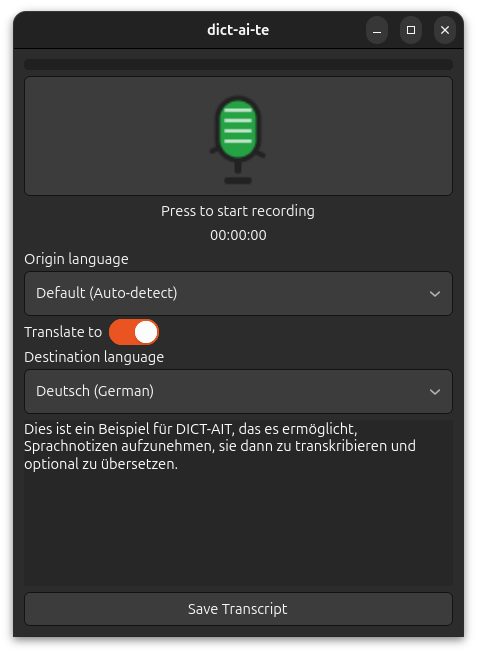
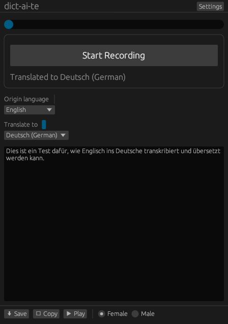

# dict-ai-te

[](LICENSE)
[](https://github.com/soyrochus/dict-ai-te)
[](./FOSS_PLURALISM_MANIFESTO.md)

**dict-ai-te** lets you record voice notes, transcribe them (via the OpenAI API), and optionally translate to a target language. Use it in two ways:

- A native desktop app with GTK 4 (Linux/macOS)
- A browser-based Web UI powered by Flask
- A Rust version (can run natively on Linux, MacOS and Windows and on Web with Wasm/WebGL)

Both experiences share the same engine and settings.


| Python GTK (Ubuntu) | Python GTK (macOS) |
| :----: | :---: |
|  |  |

| Python Web (Flask) | Rust (egui; shown on Ubuntu) |
| :----:      |:---:            |
|  | |

## Features

- Record audio notes directly from your microphone (desktop and web).
- See real-time status and elapsed recording time.
- Real-time audio level bar during recording.
- Automatic transcription using the OpenAI Whisper API.
- Edit or correct transcribed text in the main window.
- Optional translation to a selected language.
- Save transcripts as plain text files.
- Copy transcripts to your clipboard with a single click.
- Simple configuration using `.env` or environment variables for the OpenAI API key.
- Consistent settings across the GTK app and Web UI.

## Installation

**Prerequisites:**

- Python 3.8 or higher (Python 3.12+ recommended)
- Linux, macOS, or Windows
- [uv](https://github.com/astral-sh/uv) for fast dependency management

### 1. Clone the Repository

```bash
git clone https://github.com/soyrochus/dict-ai-te.git
cd dict-ai-te
```

### 2. Create and Activate a Virtual Environment

```bash
uv venv .venv
source .venv/bin/activate
```

### 3. Install Dependencies

Make sure you have a `pyproject.toml` file in the project root (define dependencies as needed).

```bash
uv sync
```

> **Note:**
On Linux, the GTK4 library which the application uses, requires installation of various packages:

```sh
sudo apt update
sudo apt install -y \
  libgtk-4-dev \
  libgirepository-2.0-dev \
  libcairo2-dev \
  pkg-config \
  python3-dev \
  python3-gi \
  python3-gi-cairo \
  gir1.2-gtk-4.0 \
  libportaudio2
 ```

On macOS, you need to install the dependencies using [Homebrew](https://brew.sh/):

```sh
    brew install gtk4 pygobject3 portaudio
```

### 4. Run the Application

```bash
python -m dictaite
```

or use the script in the bin directory

```bash
<source dir>>bin/dictaite
```

Note that the script needs to have the executable permission set.

You can also run the Web UI in your browser (see the next section for first-time setup):

```bash
bin/dictaite-web
```

### 5. Launch the Web UI

```bash
uv sync --extra ui-web
bin/dictaite-web
```

Visit `http://localhost:5000` to use the browser interface.

Quick reference:

- GTK desktop app: `bin/dictaite`
- Web UI (Flask): `bin/dictaite-web`

## Rust desktop app (egui/eframe)

There’s also a native Rust version of dict-ai-te. It lives in the Rust crate at the project root (see `Cargo.toml`) with sources under `src/`. It’s built with `eframe`/`egui` (rendered via `wgpu`) and uses:

- `cpal`/`rodio` for audio input/output
- `rfd` for native file dialogs
- `arboard` for clipboard
- `reqwest` for OpenAI HTTP calls (API key from environment or `.env`)

You can run it on Linux, macOS, and Windows. On launch it reads `OPENAI_API_KEY` from your environment or a local `.env` file.

### System Dependencies (Ubuntu 24.04 and newer)

Before building, install the development libraries this project depends on:

```bash
sudo apt update
sudo apt install -y \
   build-essential pkg-config \
   libssl-dev \
   libasound2-dev libjack-jackd2-dev \
   libx11-dev libxi-dev libxcb1-dev libxcb-render0-dev libxcb-shape0-dev libxcb-xfixes0-dev \
   libxkbcommon-dev libwayland-dev libgl1-mesa-dev libudev-dev \
   libvulkan1 vulkan-tools mesa-vulkan-drivers libvulkan-dev \
   libgtk-3-dev \
   xclip wl-clipboard
```

#### Why these are needed

- build-essential, pkg-config — compilers, linker, and pkg-config metadata.
- libssl-dev — required by `openssl-sys` (via `reqwest`).
- libasound2-dev, libjack-jackd2-dev — required by `alsa-sys` and JACK backend in `cpal`/`rodio`.
- X11/Wayland/GL stack (libx11-dev … libgl1-mesa-dev …) — required by `eframe`/`egui` with `wgpu`.
- libudev-dev — device discovery for `wgpu`.
- libvulkan1, mesa-vulkan-drivers, libvulkan-dev — Vulkan runtime and headers for `wgpu`.
- libgtk-3-dev — needed by `rfd` for native file dialogs.
- xclip, wl-clipboard — runtime helpers for `arboard` clipboard integration.

### Build and run

Make sure you have the Rust toolchain installed (via <https://rustup.rs/>). Then:

```bash
cargo build --release
```

Run it either via cargo:

```bash
cargo run --release
```

…or by launching the built binary directly:

```bash
./target/release/dict_ai_te_mock
```

Environment setup (any of the app variants):

```bash
export OPENAI_API_KEY=your_key_here
# or create a .env file in the project root with OPENAI_API_KEY=...
```

## Web UI

The Flask interface mirrors the GTK layout using TailwindCSS and vanilla JavaScript. It supports recording, live level metering,
Whisper transcription, optional translation, text-to-speech previews, download/copy helpers and keyboard shortcuts.

### Web UI prerequisites

- Python 3.12+
- `ffmpeg` (required by `pydub` to transcode browser recordings to WAV)
- OpenAI API key exported as `OPENAI_API_KEY` or placed in a `.env`

All dependecies are installed with the desktop application.

### Running the Web server

Use the convenience script or run the module directly:

```bash
bin/dictaite-web
# or
uv run -m dictaite.ui_web.app --host 0.0.0.0 --port 8080
```

Navigate to `http://localhost:8080`. The browser will prompt for microphone permissions when you start recording. MediaRecorder
produces `webm/ogg` blobs which are transcoded to 16 kHz WAV on the server before reaching Whisper.

### API overview

- `POST /api/transcribe` – multipart upload with `audio`, optional `language`, `translate`, `target_lang`. Returns JSON with
   `text`, `translatedText?`, `durationMs`.
- `POST /api/tts-test` – JSON `{ gender, text, voice? }`, returns `audio/wav` preview bytes.
- `POST /api/settings` – JSON payload to persist shared settings; `GET /api/settings` fetches current values.
- `GET /api/health` – simple readiness probe.

CORS is disabled by default. Enable it via `DICTAITE_ENABLE_CORS=true` and `DICTAITE_CORS_ORIGIN=...` in the Flask configuration
if embedding in another domain. A placeholder hook (`DICTAITE_RATE_LIMITER`) is left in `app.py` to plug in your preferred rate
limiter middleware.

### Browser controls

- `Space` – start/stop recording (ignored when the textarea is focused).
- `Ctrl/Cmd+C` – copy transcript.
- `Ctrl/Cmd+S` – download transcript as `.txt`.

The Play button synthesizes audio for the current transcript via `/api/tts-test` using the chosen voice gender.

### Settings synchronisation

Settings are stored in `~/.dictaite/settings.json` and shared with the GTK application. The web form uses the same voices and
language lists defined in `dictaite/ui_common.py`. Use the Play buttons to preview voice choices before saving.

## Configuration

1. Create a `.env` file in the project root containing your OpenAI API key:

   ```dotenv
   OPENAI_API_KEY=your_key_here
   ```

2. Alternatively, set the `OPENAI_API_KEY` environment variable:

   ```bash
   export OPENAI_API_KEY=your_key_here
   ```


## Principles of Participation

Everyone is invited and welcome to contribute: open issues, propose pull requests, share ideas, or help improve documentation.  
Participation is open to all, regardless of background or viewpoint.  

This project follows the [FOSS Pluralism Manifesto](./FOSS_PLURALISM_MANIFESTO.md),  
which affirms respect for people, freedom to critique ideas, and space for diverse perspectives.  


## License and Copyright

Copyright (c) 2025, Iwan van der Kleijn

This project is licensed under the MIT License. See the [LICENSE](LICENSE) file for details.
