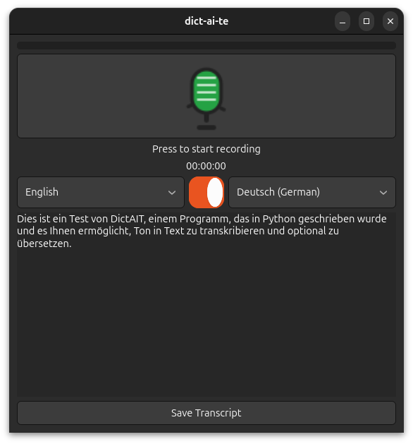

# dict-ai-te

**dict-ai-te** is a minimalist desktop application for recording voice notes, transcribing them to text (via the OpenAI API), and saving transcripts to files.

The app is designed for simplicity, with a clean UI inspired by modern voice recorders. It’s built using Python and GTK 4 via PyGObject for modern Linux desktop integration.



## Features

* Record audio notes directly from your microphone.
* See real-time status and elapsed recording time.
* Live waveform display during recording.
* Automatic transcription using the OpenAI Whisper API.
* Edit or correct transcribed text in the main window.
* Save transcripts as plain text files.
* Simple configuration using `.env` or environment variables for the OpenAI API key.

## Installation

**Prerequisites:**

* Python 3.8 or higher (Python 3.12+ recommended)
* Linux, macOS, or Windows
* [uv](https://github.com/astral-sh/uv) for fast dependency management

### 1. Clone the Repository

```bash
git clone https://github.com/soyrochus/dict-ai-te.git
cd dict-ai-te
```

### 2. Create and Activate a Virtual Environment

```bash
uv venv .venv
source .venv/bin/activate
```

### 3. Install Dependencies

Make sure you have a `pyproject.toml` file in the project root (define dependencies as needed).

```bash
uv sync
```

> **Note:**
> On Linux, PyGObject requires the `python3-gi` package:
>
> ```sh
> sudo apt install python3-gi
> ```
> And PortAudio for microphone access:
>
> ```sh
> sudo apt install portaudio19-dev
> ```

### 4. Run the Application

```bash
python -m dictaite
```

## Configuration

1. Create a `.env` file in the project root containing your OpenAI API key:

   ```dotenv
   OPENAI_API_KEY=your_key_here
   ```

2. Alternatively, set the `OPENAI_API_KEY` environment variable:

   ```bash
   export OPENAI_API_KEY=your_key_here
   ```


## License and Copyright

Copyright (c) 2025, Iwan van der Kleijn

This project is licensed under the MIT License. See the [LICENSE](LICENSE) file for details.
