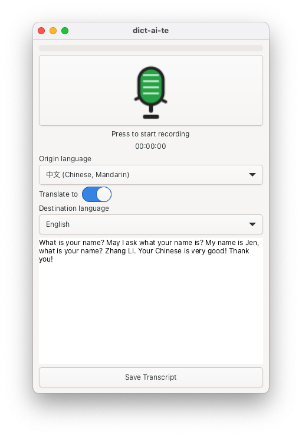

# dict-ai-te

**dict-ai-te** is a minimalist desktop application for recording voice notes, transcribing them to text (via the OpenAI API) and with optional translation to a specified target lanuage. Generated transcripts can be saved to files.

The app is designed for simplicity, with a clean UI inspired by modern voice recorders. It’s built using Python and GTK 4 via PyGObject for modern Linux desktop integration.

<table>
  <tr>
    <td align="center">
      
    </td>
    <td align="center">
      
    </td>
  </tr>
  <tr>
    <td align="center">
      Ubuntu
    </td>
    <td align="center">
      MacOS
    </td>
  </tr>
</table>

## Features

* Record audio notes directly from your microphone.
* See real-time status and elapsed recording time.
* Real-time audio level bar during recording.
* Automatic transcription using the OpenAI Whisper API.
* Edit or correct transcribed text in the main window.
* Optional translation to selected language
* Save transcripts as plain text files.
* Copy transcripts to your clipboard with a single click.
* Simple configuration using `.env` or environment variables for the OpenAI API key.

## Installation

**Prerequisites:**

* Python 3.8 or higher (Python 3.12+ recommended)
* Linux, macOS, or Windows
* [uv](https://github.com/astral-sh/uv) for fast dependency management

### 1. Clone the Repository

```bash
git clone https://github.com/soyrochus/dict-ai-te.git
cd dict-ai-te
```

### 2. Create and Activate a Virtual Environment

```bash
uv venv .venv
source .venv/bin/activate
```

### 3. Install Dependencies

Make sure you have a `pyproject.toml` file in the project root (define dependencies as needed).

```bash
uv sync
```

> **Note:**
On Linux, the GTK4 library which the application uses, requires installation of various packages:

```sh
sudo apt update
sudo apt install -y \
  libgtk-4-dev \
  libgirepository-2.0-dev \
  libcairo2-dev \
  pkg-config \
  python3-dev \
  python3-gi \
  python3-gi-cairo \
  gir1.2-gtk-4.0 \
  libportaudio2
 ```

On MacOS, you need to install the dependcies using [Homebrew](https://brew.sh/): 

```sh
    brew install gtk4 pygobject3 portaudio
```

### 4. Run the Application

```bash
python -m dictaite
```

or use the script in the bin directory

```bash
<source dir>>bin/dictaite
```

Note that the script needs to have the executable permision set.

### 5. Launch the Web UI

```bash
uv sync --extra ui-web
bin/dictaite-web
```

Visit `http://localhost:5000` to use the browser interface. See [WEBUI.md](WEBUI.md) for details.

## Configuration

1. Create a `.env` file in the project root containing your OpenAI API key:

   ```dotenv
   OPENAI_API_KEY=your_key_here
   ```

2. Alternatively, set the `OPENAI_API_KEY` environment variable:

   ```bash
   export OPENAI_API_KEY=your_key_here
   ```


## License and Copyright

Copyright (c) 2025, Iwan van der Kleijn

This project is licensed under the MIT License. See the [LICENSE](LICENSE) file for details.
